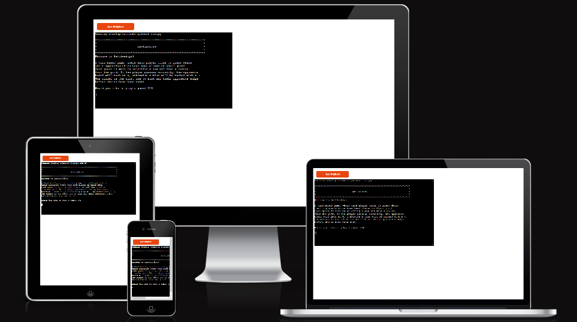
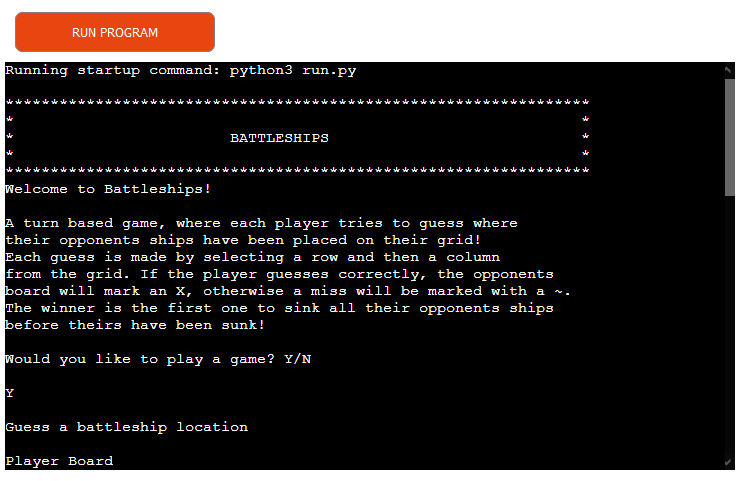
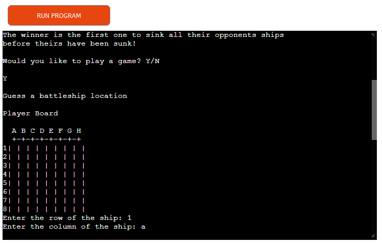
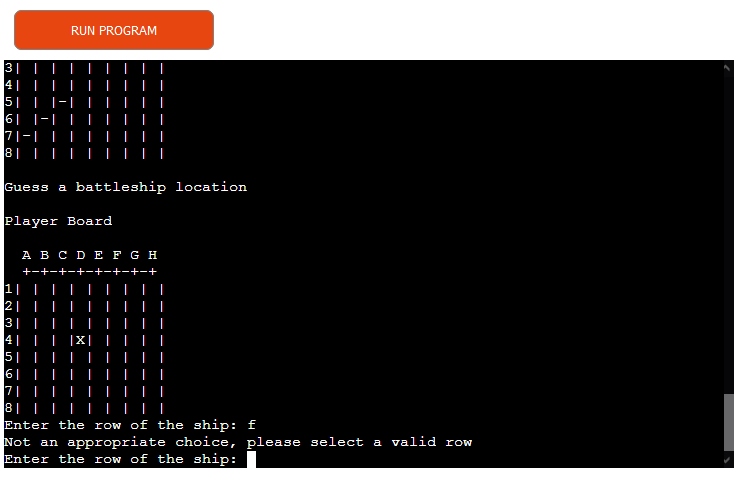
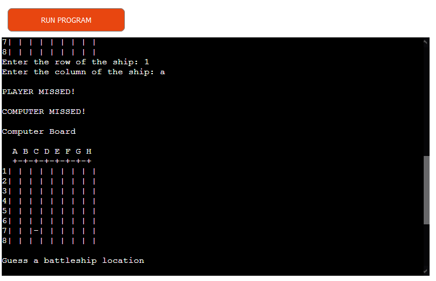
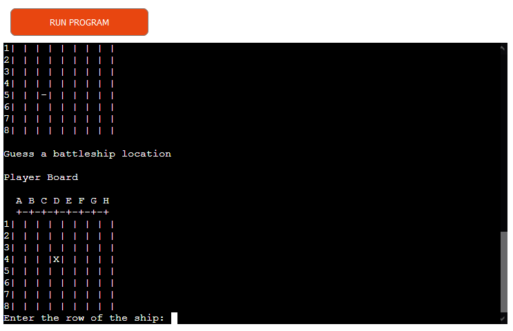
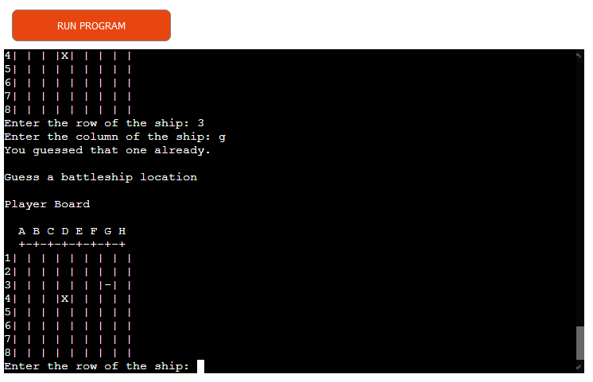
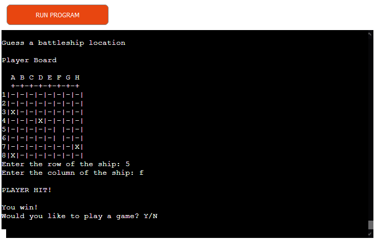
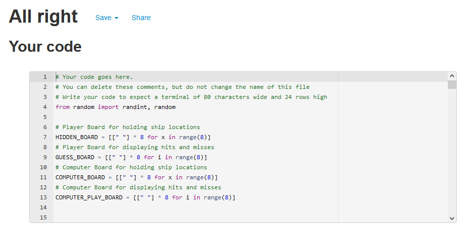

# BattleShips - Project Portfolio 3

Battleships is a Python terminal game, which runs in the Code Institute mock terminal on Heroku.

Users takes turns against the computer to guess the location of their battleships. The winner is whoever finds the location of all the opponents ships. Each battleship occupies one square on the grid.

The live link can be found here - https://projectprotfolio3-battleships.herokuapp.com/

----
## How to Play

When started up the player will be presented a screen giving them an overview of the game and how to play. They are also presented with an option to play or not.

Providing the player chooses to play, they are then presented with their empty Guess Board, where they are to then select a row and column to attack!

Only appropriate coordinates will be accepted, as per the image below, a string was entered for row choice, when it should have been an integer resulting in the error shown.

Once a valid selection has been made, the game will return a Hit or Miss to the player, and then generate the computers selection. Again returning whether they Hit or Missed the player's ships.

If either the player or computer correctly guess the location of a ship, a Hit marker will be recorded to the board. This will be marked as a 'X', otherwise any Misses are marked as '~'.

If either the player or computer try to guess a location that has already been called, they will be returned an error message stating they are trying a guess already made. The player will then be prompted to reselect, while the computer will automatically reselect their guess.

Once all ships have been hit by either player or computer, the overall outcome will be posted. The player will then be given the choice to play again or not.

----

## Features

- Randomly generated game boards
- Ships are hidden from the player, only seen once they have been 'Hit'
- Plays against the computer
- Accepts user input
- Input validation and error checking
    - Guesses can only be made within the boards grid
    - Will only accept and interger for row, and string for column
    - Same guess cannot be made twice

### Future Features

- Score board - to keep track on who has won the most games.
- Grid Size - allow the player to choose overall grid size and ships, making for a quicker or longer game.
- 2 player mode - allow for 2 players to play against each other.

----

## Testing

- On row and column selection, strings and integers were tried where not appropriate to ensure the game return the correct error message.
- Same selection was made twice to ensure that the game wouldn't allow us to make the same selection twice and loop back to make another selection.
- Likewise same process was done with the computer's turn. As they are randomly generated, we had to cycle through to make sure it notified the user that the computer had made a duplicate selection, and made it make another choice.

## Bugs

- Incorrectly looped through both player and computer turns when a selection was tried that had already been made. Need to loop back to the beginning of either players turn. Initially both were done under one function, but was split down into separate functions to allow a proper loop back, allowing both the user and computer to retry their guess.

### Remaining Bugs

- No bugs remaining 

## Validator

All code was validated with pep8online.com. Our check returned no issues with our code.

## Deployment

This project was deployed using Code Institute's mock terminal for Heroku.
- Steps for Deployment
    - Fork or clone this repository
    - Create a new Heroku app
    - Set Convig Vars to PORT and 8000
    - Set buildblocks to Python and NodeJS (in that order)
    - Link Heroku to repository
    - Click Deploy

## Credits

Basis of the board adapted from Knowledge Mavens - How to Code Battleship in Python.

----